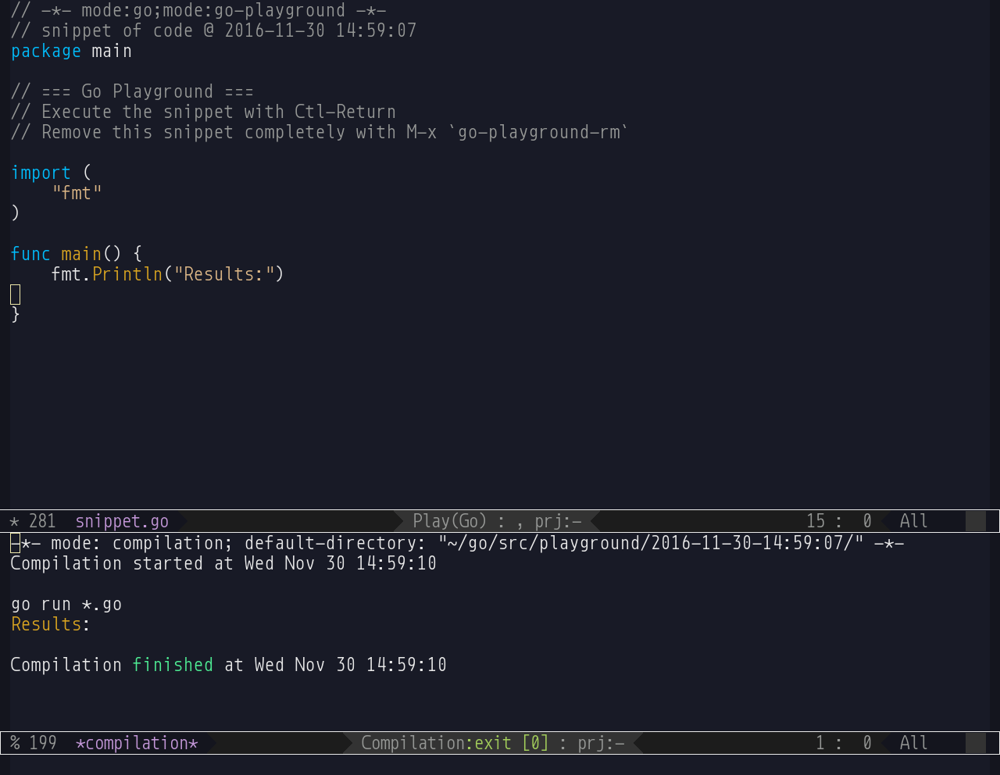

<!--*- mode:markdown;mode:orgtbl -*-->
# Local Golang playground 

The simple mode for GNU/Emacs for setting up local [Go language](http://golang.org) playground with features similar 
(and with help of `go-mode` even outperform!) to [play.golang.org](http://play.golang.org). This is not a wrapper for working with play.golang.org from Emacs,
this is complete alternative for setting local playground inside Emacs.

Web playground at play.golang.org is nice idea. It has not require setup and it executes your code
in a restricted environment where you can't damage you system. But it brings many restrictions too.
Local playground requres you to setup Go environment but if you developing in Go (or want to do it)
you are anyway need setup `go-mode` and helper modes for working with code in a comfort way.

So with local go-playground you get:

* all features of [go-mode](https://github.com/dominikh/go-mode.el) will work in `go-playground`
* snippets saved in the subdirectory under GOPATH, it helps you keep library of interesting snippets
* you can split the snippet code on any number of files
* no containers and no restrictions on compile time so you can test the complex code
* free for using any external packages from your GOPATH

## Install

Firstly install `go-mode` and `gotest` — these are mandatory. Setup any additional tools you want for Golang
(see Emacs Wiki for guides or google for "emacs+golang"). Personally I recommend use `goimports` for
automatically add import clauses to your snippets. Because usually when you test some ideas you want get
working code as fast as possible. And `goimports` helps with it.

Install `go-playground` from MELPA:

    M-x package-install RET go-playground

If you want share snippets use `go-play-buffer` from `go-mode`.
Install `gist-buffer` from MELPA if you want publish gists on github.com.

## Usage

### Quick start

#. From any mode run `M-x go-playground` for start a new playground buffer filled with basic template for `main` package (see the picture below).
#. Add your code and the press `Ctl-Return` (bind for the command `go-playground-run`). It will save, compile and exec the snippet code.
#. When you played enough with this snippet just run `M-x go-playground-rm`. It will remove the current snippet with its directory and all files.

Mode not offers default bindings except `Ctl-Return`. It just lefts the space for you.

For easy running the template declares `main` package with defined `main()` function. Each snippet saved to its own
directory (named by timestamp by default). Remember `go-playground` runs the compiler as `go run *.go` so any sources
from the snippet directory will be included.

### List of interactive functiong

<!---
#+ORGTBL: SEND keys orgtbl-to-gfm
| Function name            | Description                                                                |
|--------------------------+----------------------------------------------------------------------------|
| `go-playground`          | Create a new playground buffer with basic template for the `main` package. |
| `go-playground-download` | Download the snippet from the URL at play.golang.org.                      |
| `go-playground-exec`     | Save, compile and run the code of the snippet.                             |
| `go-playground-upload`   | Upload the buffer to play.golang.org and return the short URL.             |
| `go-playground-rm`       | Remove the snippet with its directory with all files.                      |
-->
<!--- BEGIN RECEIVE ORGTBL keys -->
| Function name | Description |
|---|---|
| `go-playground` | Create a new playground buffer with basic template for the `main` package. |
| `go-playground-download` | Download the snippet from the URL at play.golang.org. |
| `go-playground-exec` | Save, compile and run the code of the snippet. |
| `go-playground-upload` | Upload the buffer to play.golang.org and return the short URL. |
| `go-playground-rm` | Remove the snippet with its directory with all files. |
<!--- END RECEIVE ORGTBL keys -->

Example screen after creation of a new snippet:

## Similar projects

* Try [go-scratch](https://github.com/shosti/go-scratch.el) it even simplier than `go-playground`. But it prevents you from using many of tools because it not keeps code in files.
* [gorepl-mode](https://github.com/manute/gorepl-mode) is REPL for Go, helpful for interactive research of code.

## Licence

Under terms of GPL v3. See LICENSE file.

## Future plans and accepting contributions

I don't want to make this package much complex. Most of `go-playground` functions depends on other packages around `go-mode`.
And it is good way. 
But one thing I want to add is snippet list buffer where you can easily find and edit/delete snippets of your library.
Bugfixes and small features accepted as well.
